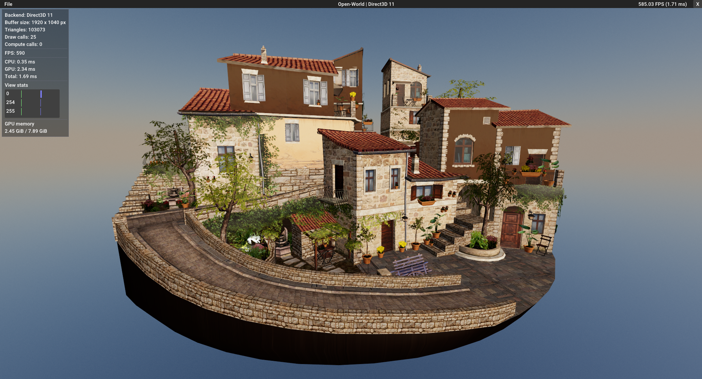

# Equilibrium Engine
[Check out DeepWiki documentation](https://deepwiki.com/clibequilibrium/EquilibriumEngine/1-overview)

Equilibrium Engine is a data-oriented and multi-threaded **C11** game engine that takes advantage of **ECS** pattern followed by **Hot-Reloading** of your libraries and shaders which allows you to quickly iterate on different aspects of your projects.

## Features
#### clang is the primarily supported compiler

  * [Entity Component System](https://github.com/SanderMertens/flecs) & [entity inspector](https://www.flecs.dev/explorer/)
  * Engine UI & Scripts [hot reloading](https://github.com/fungos/cr)
  * Shader hot reloading [via file watcher](https://github.com/nikp123/x-watcher)
  * Forward & Deferred shading. [PBR & HDR Tonemapping](https://github.com/pezcode/Cluster)
  * [cgltf](https://github.com/jkuhlmann/cgltf) or [Assimp](https://github.com/assimp/assimp) model loading
  * **C99/C11** API with some links to **C++** libraries such as [BGFX](https://github.com/bkaradzic/bgfx) & [imgui](https://github.com/ocornut/imgui)
  * Crash protection against **SEGFAULT**, **SIGABRT**; in case your system accidentally accesses a **NULL** pointer or asserts in their callbacks - the engine won't crash and will fallback to its previous working library (*currently Windows only*) 

#### Hot-Reloading of shaders & scripts

https://user-images.githubusercontent.com/105135724/199751023-b44df702-53ee-445d-8b08-f2b31ed1e369.mp4

#### [Crash protection](https://tinyurl.com/m5azjhdz)

#### Flecs entity inspector

https://user-images.githubusercontent.com/105135724/199751066-ff07918d-c067-463c-93a7-f3cceeaeee6e.mp4

## Usage

*Equilibrium* works on **Window**s via **clang only** and was tested some time ago on Ubuntu 20.04 LTS using GCC compiler. More work needs to be done to make sure the engine runs perfectly on both **Linux** & **Mac**.

#### To get started on Windows
* [Install CMake](https://cmake.org/download/)
* [Install LLVM](https://releases.llvm.org/)

*You might need Visual Studio build tools installed so clang can link to MSVC static libraries. In case if Visual Studio is your primarily IDE please consider following [these steps](https://learn.microsoft.com/en-us/cpp/build/clang-support-cmake?view=msvc-170) and check the issues section if you have troubles building the engine.*

The rest of the dependencies included within the project:

* assimp
* bgfx
* cglm
* cgltf
* cimgui
* cr
* flecs
* SDL2
* x-watcher

## Screenshots

